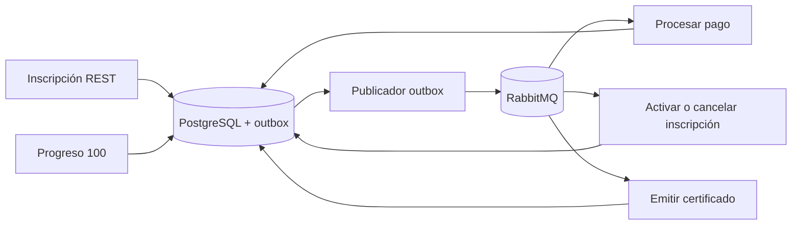

# Event-driven Course Platform

Backend de una plataforma de cursos construido con Java 21, Spring Boot 4, PostgreSQL y RabbitMQ. El proyecto se centra en aforo concurrente, idempotencia, pagos asíncronos, certificados por eventos y una entrega reproducible con Docker Compose.

## Arranque rápido

Solo se necesita Docker Desktop con Compose v2. Maven se ejecuta mediante el wrapper incluido.

```powershell
Copy-Item .env.example .env
docker compose up -d --build --wait
powershell -NoProfile -ExecutionPolicy Bypass -File scripts/smoke-test.ps1
```

En Linux, macOS o Git Bash:

```sh
cp .env.example .env
docker compose up -d --build --wait
./scripts/smoke-test.sh
```

El smoke test autentica un administrador, crea y publica un curso, autentica un estudiante, realiza una inscripción, espera la confirmación asíncrona del pago, completa el progreso y verifica el certificado público. El resultado esperado es `8/8 PASS`.

Para detener el entorno conservando los datos:

```sh
docker compose stop
```

Para eliminar los contenedores y los volúmenes creados por este proyecto:

```sh
docker compose down --volumes
```

## Servicios locales

| Servicio | Dirección |
|---|---|
| API | http://localhost:8080 |
| Swagger UI | http://localhost:8080/swagger-ui/index.html |
| OpenAPI JSON | http://localhost:8080/v3/api-docs |
| Actuator health | http://localhost:8080/actuator/health |
| MCP Streamable HTTP | http://localhost:8080/mcp |
| RabbitMQ Management | http://localhost:15672 |
| Prometheus | http://localhost:9090 |
| Grafana | http://localhost:3000/d/course-platform-overview |

RabbitMQ usa `course_platform/course_platform_dev` y Grafana `admin/admin` en el entorno local. Son credenciales de demostración, sustituibles mediante variables de entorno, y no deben reutilizarse fuera de desarrollo.

## Usuarios de demostración

Los tres usuarios iniciales usan la contraseña local `password`.

Los perfiles creados desde la API o MCP reciben su rol correspondiente y una credencial inicial BCrypt tomada de `PROVISIONING_PASSWORD`. El valor predeterminado solo permite probar el aprovisionamiento local y debe reemplazarse o integrarse con un flujo de invitación antes de usar el sistema fuera de desarrollo. La credencial nunca aparece en las respuestas.

| Rol | Usuario |
|---|---|
| ADMIN | `admin@example.test` |
| INSTRUCTOR | `instructor@example.test` |
| STUDENT | `student@example.test` |

```http
POST /api/v1/auth/login
Content-Type: application/json

{"email":"student@example.test","password":"password"}
```

Las operaciones protegidas reciben `Authorization: Bearer <token>`. La inscripción también exige `Idempotency-Key`. Repetir la misma petición con la misma clave y actor devuelve la inscripción existente; reutilizar la clave para otro curso produce un conflicto.

## Arquitectura

La aplicación es un monolito modular. `identity`, `catalog`, `enrollment`, `payment`, `certificate` y `messaging` separan API, aplicación, dominio e infraestructura. Los controladores y listeners validan, traducen y delegan; las reglas y los límites transaccionales viven en los casos de uso.

PostgreSQL es la fuente de verdad. Spring Data JPA se usa para persistencia convencional y JDBC queda encapsulado detrás de puertos para idempotencia, actualizaciones condicionales, outbox y proyecciones relacionales. Las entidades JPA no se exponen como DTO de la API.

La plaza se reserva con un `UPDATE` condicional que exige curso publicado y `occupied_seats < capacity`. La reserva, la inscripción pendiente, el pago, la clave idempotente y `EnrollmentCreatedV1` se escriben en la misma transacción. Una restricción SQL impide además que la ocupación supere el aforo.

El outbox reclama eventos mediante `FOR UPDATE SKIP LOCKED` y asigna un lease de 30 segundos. La transacción de claim termina antes de esperar el publisher confirm de RabbitMQ. Un evento solo se marca como publicado después del ACK; los fallos se reprograman.

La explicación detallada, incluidos límites e invariantes, está en [docs/architecture.md](docs/architecture.md). La relación entre requisitos y pruebas está en [docs/verification-matrix.md](docs/verification-matrix.md).

## Flujo de eventos



El exchange `course-platform.events` usa routing keys versionadas:

- `enrollment.created.v1` inicia el procesamiento del pago.
- `payment.simulation-requested.v1` procesa una confirmación o fallo solicitado.
- `payment.confirmed.v1` y `payment.failed.v1` activan o cancelan la inscripción.
- `enrollment.completed.v1` emite el certificado.

Cada cola tiene una DLQ propia. Los listeners realizan tres intentos totales con backoff de 100 y 200 ms; después rechazan el mensaje hacia la DLQ. `processed_events` deduplica por consumidor e identificador de evento para soportar entrega al menos una vez.

Los mensajes son JSON y llevan `messageId`, `eventType`, `eventVersion`, `occurredAt`, `correlationId` y, cuando corresponde, `causationId`.

## API y errores

Swagger documenta las 29 operaciones REST, sus parámetros, seguridad, resultados correctos y errores. Operaciones principales:

- CRUD de `/api/v1/categories`, `/api/v1/instructors` y `/api/v1/courses`.
- Transiciones `POST /api/v1/courses/{id}/publish` y `/archive`.
- Búsqueda combinable en `GET /api/v1/courses/search`.
- Paginación keyset por cursor opaco en `GET /api/v1/courses/search/cursor`, restringida a cursos publicados.
- Archivado explícito de categorías en `POST /api/v1/categories/{id}/archive`.
- Inscripción en `POST /api/v1/courses/{courseId}/enrollments`.
- Pago simulado en `POST /api/v1/payments/{id}/simulate`.
- Progreso y cancelación en `/api/v1/enrollments/{id}`.
- Relaciones paginadas en `/api/v1/courses/{courseId}/students` y `/api/v1/students/{studentId}/courses`.
- Verificación pública en `GET /api/v1/certificates/verify/{verificationCode}`.

La búsqueda acepta categoría, nivel, precio mínimo y máximo, texto del título y disponibilidad. Los listados nunca concatenan directamente el valor de `sort`: cada campo se traduce desde una lista blanca y añade el identificador como desempate estable.

Los errores gestionados por la API usan `application/problem+json` e incluyen `errorCode`, `correlationId` y `timestamp`. Las respuestas de validación añaden `fieldErrors`; el fallback de integridad no expone SQL ni trazas internas.

## Seguridad

La autenticación es JWT bearer sin sesión. Las contraseñas de los usuarios se almacenan con BCrypt. Los roles mínimos son:

- `ADMIN`: gestión del catálogo y consulta global.
- `INSTRUCTOR`: creación y gestión de sus propios cursos y consulta de sus inscripciones.
- `STUDENT`: inscripción, pago simulado, progreso, cancelación y consulta de sus datos.

`AuthorizationService` comprueba ownership contra PostgreSQL. Un token válido no permite operar sobre cursos, pagos o inscripciones de otro usuario. `JWT_SECRET`, contraseñas de infraestructura y demás valores sensibles se inyectan mediante variables de entorno.

## MCP

Se usa `org.springframework.ai:spring-ai-starter-mcp-server-webmvc` con transporte Streamable HTTP en `/mcp`. Las tools delegan en los mismos casos de uso que REST y no contienen datos hardcodeados. La identidad se deriva del JWT; ninguna tool acepta `actor`, `actorUserId` o `userId` como identidad manipulable.

| Tool | Parámetros | Acceso |
|---|---|---|
| `list_courses` | `page`, `size`, `sort` | autenticado |
| `search_courses` | `categoryId`, `level`, `minPrice`, `maxPrice`, `title`, `available`, `page`, `size`, `sort` | autenticado |
| `get_course` | `id` | autenticado |
| `create_course` | datos del curso, `categoryId`, `instructorId` | ADMIN o instructor asignado |
| `update_course` | `id` y datos del curso | ADMIN o propietario |
| `delete_course` | `id` | ADMIN o propietario |
| `publish_course` | `id` | ADMIN o propietario |
| `archive_course` | `id` | ADMIN o propietario |
| `list_categories` | `page`, `size`, `sort` | autenticado |
| `get_category` | `id` | autenticado |
| `create_category` | `name`, `description` | ADMIN |
| `update_category` | `id`, `name`, `description` | ADMIN |
| `archive_category` | `id` | ADMIN |
| `delete_category` | `id` | ADMIN |
| `list_instructors` | `page`, `size`, `sort` | ADMIN |
| `get_instructor` | `id` | ADMIN |
| `create_instructor` | `name`, `email`, `biography` | ADMIN |
| `update_instructor` | `id`, `name`, `email`, `biography` | ADMIN |
| `delete_instructor` | `id` | ADMIN |
| `list_students` | `page`, `size` | ADMIN |
| `get_student` | `id` | ADMIN o propietario |
| `create_student` | `firstName`, `lastName`, `email` | ADMIN |
| `update_student` | `id`, `firstName`, `lastName`, `email` | ADMIN o propietario |
| `enroll_student` | `courseId`, `idempotencyKey` | STUDENT |
| `get_enrollment` | `id` | ADMIN o propietario |
| `list_students_by_course` | `courseId`, `page`, `size`, `sort` | ADMIN o instructor propietario |
| `list_courses_by_student` | `studentId`, `page`, `size`, `sort` | ADMIN o estudiante propietario |
| `update_enrollment_progress` | `enrollmentId`, `value` | ADMIN o propietario |
| `cancel_enrollment` | `enrollmentId` | ADMIN o propietario |

Para probarlo con MCP Inspector o MCPJam:

1. Obtenga un token mediante `POST /api/v1/auth/login`.
2. Configure el transporte Streamable HTTP con URL `http://localhost:8080/mcp`.
3. Añada `Authorization: Bearer <token>` a la conexión.
4. Ejecute `list_courses` con `page=0`, `size=10` y `sort=title,asc`.

Una conexión sin token recibe 401.

## Observabilidad

Actuator expone health, info, métricas, liveness y readiness. PostgreSQL y RabbitMQ aparecen como componentes del health. Los logs son JSON e incluyen `correlationId`, `traceId` y `spanId` cuando están disponibles. El correlation ID HTTP se conserva en el outbox y los mensajes AMQP derivados mantienen esa correlación y registran como causation ID el evento que los originó.

Micrometer publica contadores de inscripciones, pagos, certificados, caché, rate limiting y outbox. Prometheus consulta `/actuator/prometheus`; Grafana arranca con el datasource Prometheus y el dashboard `Course Platform Overview` provisionados. El dashboard muestra disponibilidad, tráfico HTTP, latencia, inscripciones, pagos, certificados, outbox, caché y rate limiting. Las trazas se envían mediante OTLP al OpenTelemetry Collector, que usa el exporter `debug` para permitir su inspección local sin un backend externo.

Redis implementa caché de catálogo y un token bucket Lua atómico. Si Redis falla, las lecturas ordinarias degradan en fail-open; login y simulación de pago fallan de forma cerrada.

## Pruebas

En Windows:

```powershell
.\mvnw.cmd spotless:check clean verify
```

En Linux o macOS:

```sh
./mvnw spotless:check clean verify
```

La suite incluye tests unitarios, MockMvc, ArchUnit y Testcontainers para PostgreSQL, RabbitMQ y Redis. Cubre aforo con diez hilos, replay idempotente, transiciones concurrentes, outbox y rollback, publisher confirms, mensajes duplicados, DLQ, ownership, N+1, OpenAPI, MCP y observabilidad. JaCoCo genera el informe en `target/site/jacoco/index.html`.

GitHub Actions ejecuta el mismo comando con Java 21 y conserva los informes como artefactos aunque falle el job.

## Variables principales

| Variable | Uso |
|---|---|
| `POSTGRES_DB`, `POSTGRES_USER`, `POSTGRES_PASSWORD` | Base de datos de Compose |
| `DB_URL`, `DB_USERNAME`, `DB_PASSWORD` | Conexión JDBC de la aplicación |
| `RABBITMQ_HOST`, `RABBITMQ_PORT`, `RABBITMQ_USERNAME`, `RABBITMQ_PASSWORD` | Conexión AMQP |
| `REDIS_HOST`, `REDIS_PORT` | Caché y rate limiting |
| `JWT_SECRET` | Firma HS256 del token |
| `PROVISIONING_PASSWORD` | Credencial inicial BCrypt para perfiles creados por API o MCP |
| `PAYMENT_ENROLLMENT_CREATED_OUTCOME` | Resultado automático `CONFIRM` o `FAIL` |
| `OUTBOX_SCHEDULING_ENABLED`, `OUTBOX_FIXED_DELAY` | Publicador del outbox |
| `OTEL_EXPORTER_OTLP_TRACES_ENDPOINT` | Destino OTLP |
| `TRACING_SAMPLE_PROBABILITY` | Muestreo de trazas |

Los valores de `.env.example` son exclusivamente locales.

## Decisiones y límites

- Se eligió un monolito modular para mantener transacciones locales e invariantes sin introducir coordinación distribuida innecesaria.
- El pago es una simulación deliberada; el diseño demuestra el ciclo asíncrono, no una integración con una pasarela real.
- La entrega es al menos una vez. El outbox evita pérdidas tras el commit y los consumidores hacen idempotentes los efectos.
- Los virtual threads ayudan en esperas bloqueantes del stack servlet, JDBC y AMQP, pero los pools externos siguen limitando la concurrencia efectiva.
- Grafana provisiona el datasource y un dashboard operativo básico; las alertas y la retención se dejan al entorno de despliegue.
