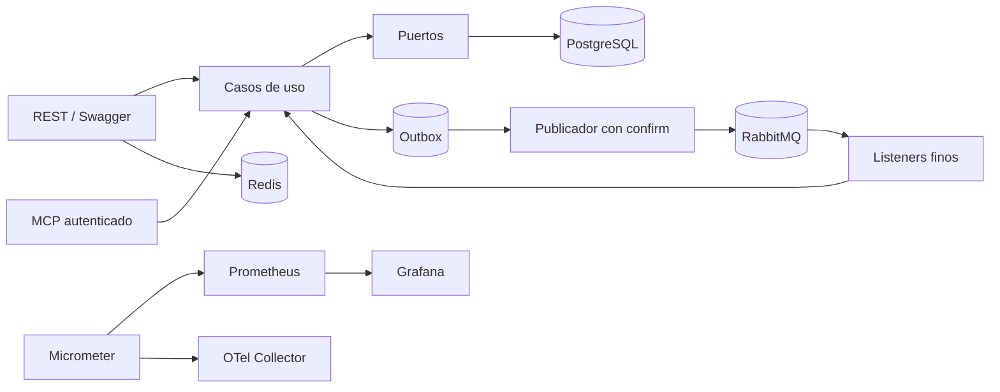

# Arquitectura

## Componentes

La separación principal es por capacidad de negocio. Los adaptadores REST, MCP y AMQP delegan en servicios de aplicación. Los tipos de dominio protegen invariantes puras, como el archivado de categorías. Las transiciones sensibles a concurrencia se expresan como actualizaciones SQL condicionales detrás de puertos; no se afirma que cada cambio atraviese un agregado en memoria. La infraestructura implementa persistencia, mensajería y observabilidad.

Spring Data JPA se reserva para persistencia convencional. JDBC implementa operaciones en las que importa conocer exactamente las filas afectadas: reserva de plaza, idempotencia, transiciones terminales, claim del outbox y proyecciones relacionales. Estas consultas permanecen detrás de puertos y no llegan a controladores ni listeners.

## Consistencia y concurrencia

La inscripción es una sola transacción: registra la clave idempotente, reserva plaza, crea inscripción y pago y añade el evento outbox. La reserva usa una actualización condicional y PostgreSQL vuelve a comprobar `occupied_seats <= capacity`.

Los resultados de pago compiten desde `PENDING`; solo el primer `UPDATE` puede ganar y solo ese ganador añade el evento terminal. El progreso es monotónico y únicamente la transición `ACTIVE -> COMPLETED` añade `EnrollmentCompletedV1`. Una inscripción pendiente cancela también su pago; una inscripción activa conserva el pago confirmado. Ambos caminos liberan exactamente una plaza y el bloqueo de filas impide estados incompatibles o dobles liberaciones.

## Outbox y RabbitMQ

`JdbcOutboxStore` reclama lotes con `FOR UPDATE SKIP LOCKED` y mueve `available_at` 30 segundos. Al terminar esa transacción no quedan locks durante la espera del broker. `OutboxPublisher` usa publisher confirms y `PublishOutboxBatchUseCase` decide entre marcar ACK o reprogramar.

RabbitMQ declara un topic exchange duradero, un direct exchange de dead letters, cuatro colas de consumo y cuatro DLQ. Spring Retry realiza dos reintentos después del intento inicial, con backoff de 100 y 200 ms. Los casos de uso reclaman `(consumer_name,event_id)` en `processed_events` antes de producir efectos.

Cada listener construye un contexto inmutable a partir de `correlationId` y `messageId`. Los eventos derivados conservan la correlación original y usan como causation ID el identificador del mensaje que activó el caso de uso.

## Seguridad

JWT HS256 identifica al usuario y transporta sus roles. BCrypt protege contraseñas. `AuthorizationService` resuelve ownership en PostgreSQL para cursos, estudiantes, pagos e inscripciones. MCP obtiene el mismo actor desde el contexto de seguridad y no admite identificadores de actor en los argumentos de las tools.

## Lecturas

Los listados relacionales usan proyecciones JDBC con una consulta para datos y otra para el total. No recorren asociaciones lazy, por lo que su número de consultas no crece con el número de filas. `SortSpec` traduce campos conocidos a expresiones SQL y añade `id` como desempate.

## Disponibilidad y operación

Compose levanta aplicación, PostgreSQL, RabbitMQ, Redis, OpenTelemetry Collector, Prometheus y Grafana. Los health checks ordenan el arranque. La aplicación expone métricas de negocio, probes y logs JSON correlacionados. Grafana carga el dashboard `Course Platform Overview` desde control de versiones. El entorno local prioriza reproducibilidad; las credenciales de ejemplo deben reemplazarse en cualquier despliegue real.
